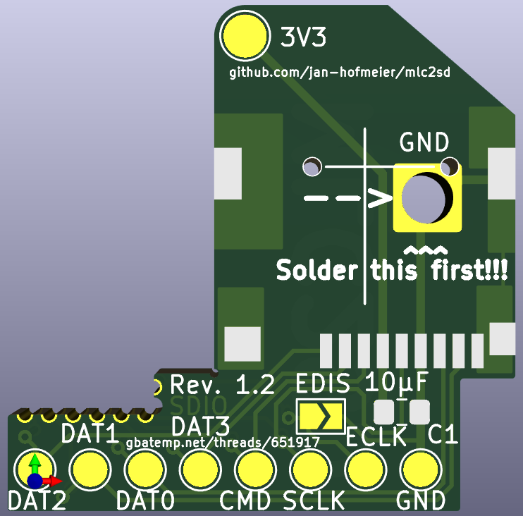

# mlc2sd
Interposer for the Wii U to replace the eMMC (mlc) with an SD card

## Order Options

When ordering this interposer, don't forget to select the `Half-cut/Castellated holes` option and set the PCB `Thickness` to $0.8mm$ or thiner.

## How to use

There are Tutorials on gbatemp:

- Rebuild mlc: https://gbatemp.net/threads/how-to-upgrading-rebuilding-wii-u-internal-memory-mlc.636309/
- Clone mlc: https://gbatemp.net/threads/using-nand-aid-to-repair-a-broken-emmc-fix-160-0103-system-memory-error.636361/

